# 🧠 NeuraQuiz AI-Powered Quiz Generator

**NeuraQuiz** is an interactive AI-driven quiz platform that generates smart, topic-based questions using **LLM(Google Gemini AI)**. Built with **Django**, powered by **Python**, and served on the cloud with **Render** and **Aiven PostgreSQL**, it offers a fast, reliable, and modern learning experience.

🔗 **Live Website:** [Link](https://neuraquiz-xjml.onrender.com)

---

## ✨ Key Features

- **AI Question Generation:** Dynamically creates unique quiz questions using Gemini AI.  
- **Multiple Difficulty Levels:** Choose from beginner to expert quizzes.  
- **Persistent Database:** Cloud PostgreSQL hosted on Aiven (free & permanent).  
- **User Management:** Secure login, admin panel, and quiz progress tracking.  
- **Modern Interface:** Built with responsive HTML, CSS, and JavaScript frontend.
- **Smart Analytics:** Gain AI-powered insights into your quiz performance with personalized improvement tips.
- **Role-Based Access:** Separate dashboards and tools for students and instructors for a smoother experience.

---

## ⚙️ Tech Stack

| Layer | Technology |
|:------|:------------|
| **Frontend** | HTML, CSS, JavaScript |
| **Backend** | Python, Django |
| **AI Integration** | Google Gemini API |
| **Database** | Aiven PostgreSQL *(Production)* / SQLite3 *(Development)* |
| **Hosting** | Render Web Service |
| **Version Control** | Git + GitHub |

---

## 🧩 Architecture Overview

```
+--------------------------+
|        Frontend          |
| HTML • CSS • JavaScript  |
+-----------+--------------+
            |
            ▼
+--------------------------+
|        Backend           |
| Python • Django • Gemini |
+-----------+--------------+
            |
            ▼
+--------------------------+
|        Database          |
| Aiven PostgreSQL / SQLite|
+--------------------------+
```

---

## 🧠 Gemini AI Integration

NeuraQuiz uses **Gemini API** for generating intelligent quiz questions.  
API model used: `gemini-2.5-pro`

Example integration snippet (from backend):
```python
response = model.generate_content(prompt)
questions = parse_questions(response.text)
```

---

## 🌐 Project UI Screens

### 🖥️ Landing Page

<p align="center">
  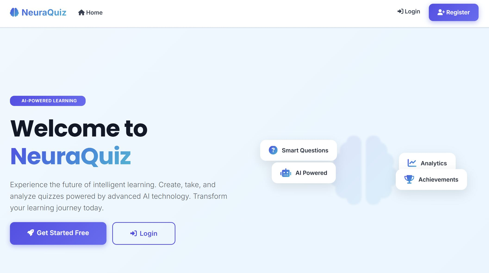
  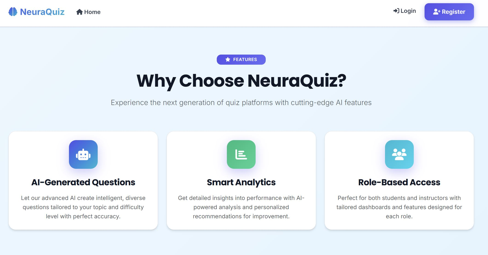
  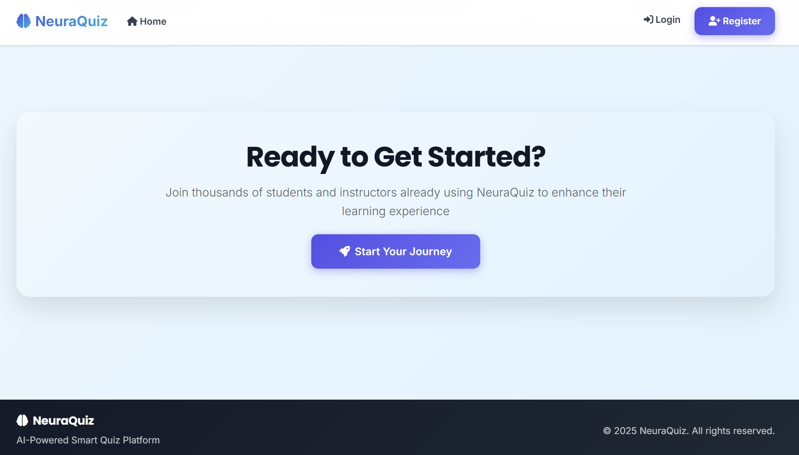
</p>

### Register & Login Page

<p align="center">
  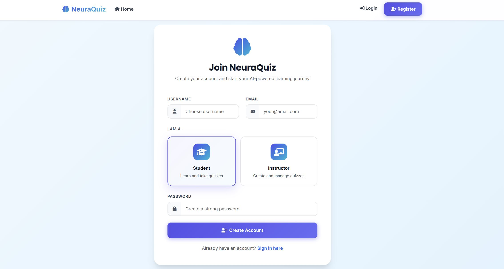
  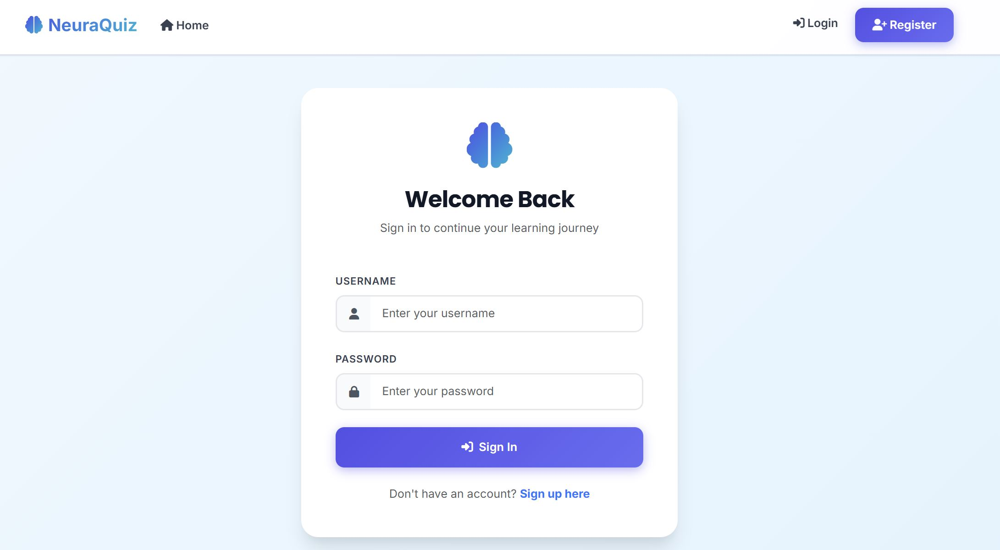
</p>

---

## Instructor

<p align="center">
  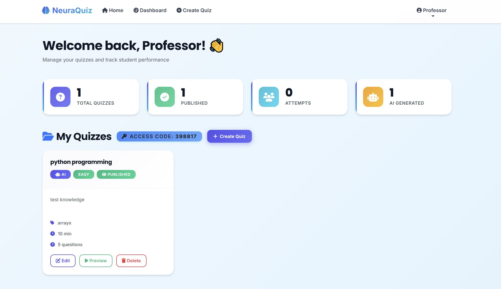
  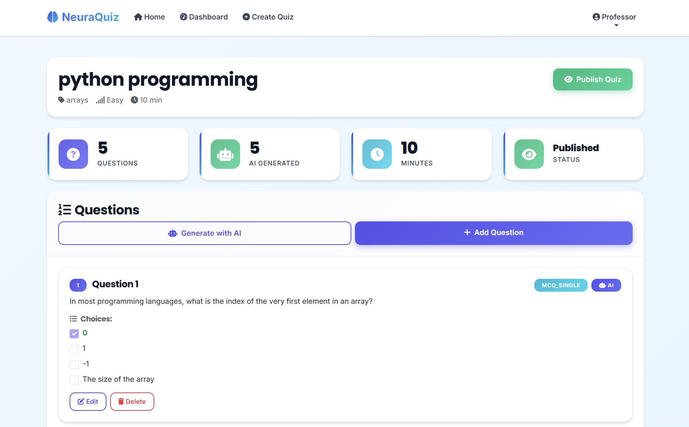
  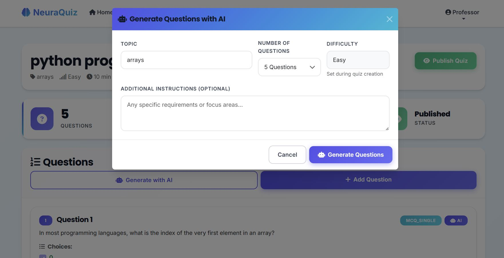
</p>

---

## Student

<table align="center">
  <tr>
    <td>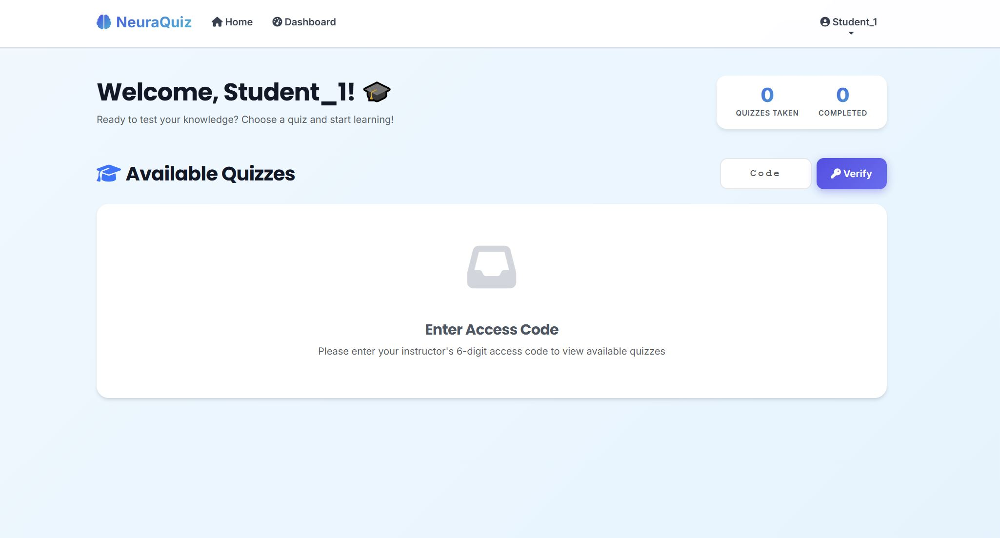</td>
    <td>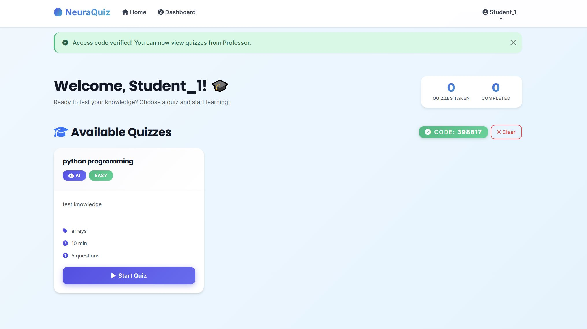</td>
  </tr>
  <tr>
    <td>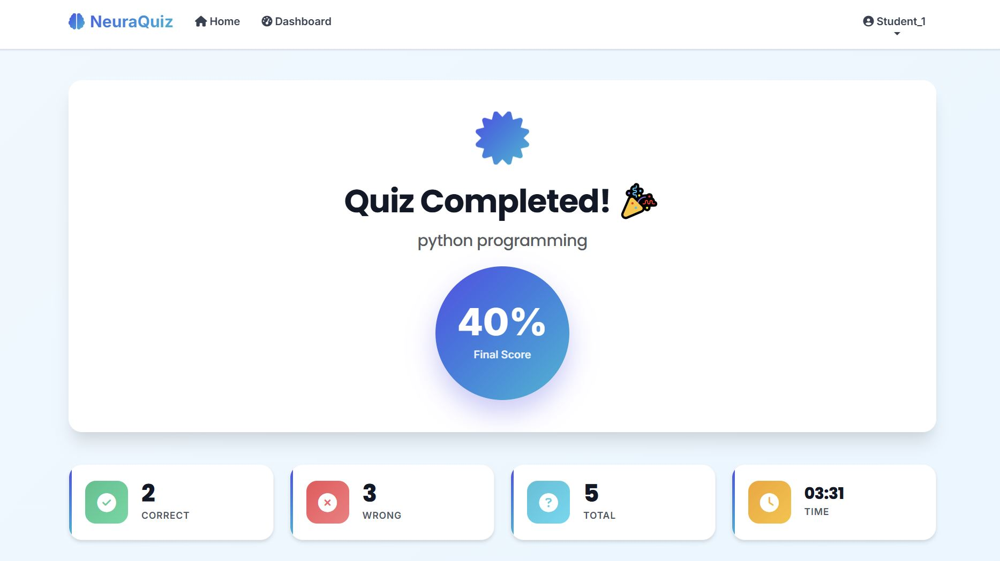</td>
    <td>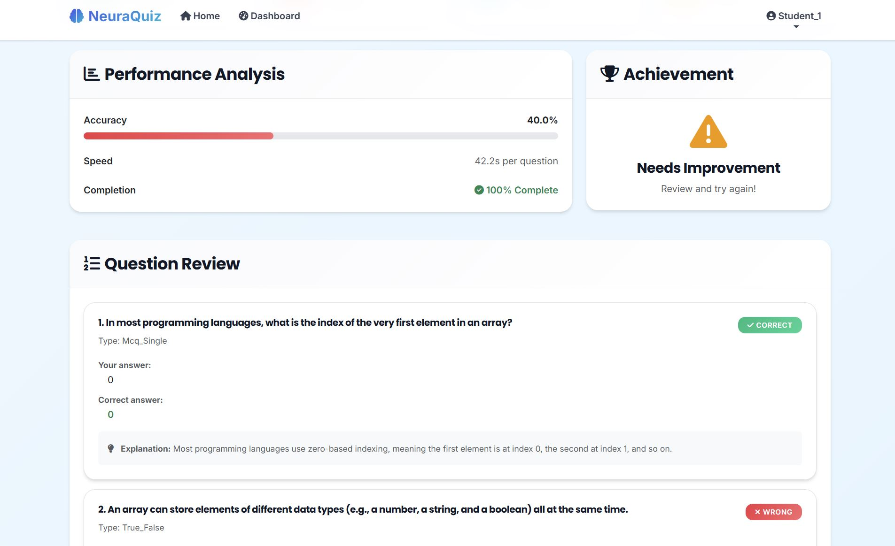</td>
  </tr>
  <tr>
    <td>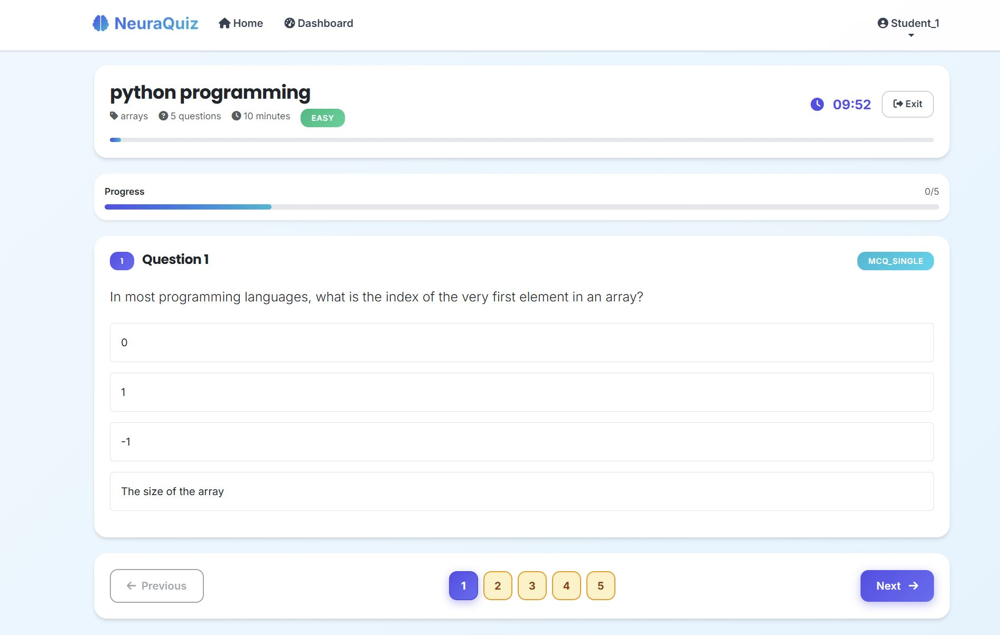</td>
    <td>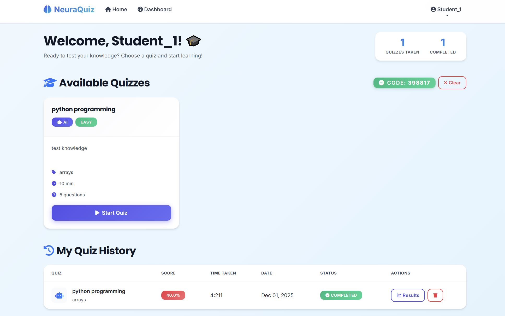</td>
  </tr>
</table>

---

## 🧾 License
This project is released under the **MIT License** you are free to use, modify, and distribute it.

---

## 💡 Author
**Developed by [Aditya Shinde](https://github.com/Shadow-919)**  
📧 *adityashinde54321@gmail.com*

---

## 🌟 Acknowledgments
- [Django Framework](https://www.djangoproject.com/)
- [Google Gemini API](https://ai.google.dev/)
- [Aiven PostgreSQL](https://aiven.io/)
- [Render Hosting](https://render.com/)

---

### ⭐ If you like this project, give it a star on GitHub!
